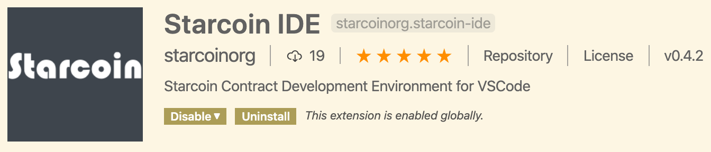

<!--
class: lead invert
_paginate: false
 -->

# Move 合约懒人指南

---

<!--
_class: lead invert
 -->

## Outlines

- Key **Concepts** of Move
- Learn by *Examples*
- Development Tools
- Q & A


---
<!--
_class: lead invert
 -->

## Key Concepts

- **module** and **script**.
- **owenedship oriented**.
- **first class resource**.
- **generic**.
- **account** model.
- **resource** is the **bridge** of contracting with **module**.


---


Module


```
module Coin {
  struct Coin {
    value: u64,
  }
  public fun new(value: u64): Coin {
    Coin {
      value
    }
  }
  public fun value(coin: Coin): u64 {
    coin.value
  }
}
```
---

Scoped Module

```
address 0x2 {
module Coin {
  struct Coin {
    value: u64,
  }
  public fun new(value: u64): Coin {
    Coin {
      value
    }
  }
  public fun value(coin: Coin): u64 {
    coin.value
  }
}
}
```

---

Script

```
script {
  use 0x2::Coin;
  // use 0x1::Debug;
  fun create_coin() {
    let value = 100u64;
    let coin = Coin::new(100);
    let v = Coin::value(coin);
    assert(v == value, 400);
  }
}
```

---

Resource

```
module Coin {
  resource struct Coin {
    value: u64
  }
  public fun new(value: u64): Coin {
    Coin { value }
  }
  public fun value(coin: &Coin): u64 { coin.value }
  public fun deposit(coin: &mut Coin, coin2: Coin) {
    let Coin {value} = coin2;
    coin.value = coin.value + value;
  }
  public fun withdraw(coin: &mut Coin, value: u64): Coin {
    coin.value = coin.value - value;
    Coin { value }
  }
  public fun destroy(coin: Coin) {
    let Coin {value: _} = coin;
  }
}
```

---


### Ownership

_move_ and `copy`


---

**move** by default

```
script {
  use 0x2::Coin;
  use 0x1::Signer;
  fun create_coin() {
    let value = 100u64;
    let coin = Coin::new(100);
    let v = Coin::value(coin);
    assert(v == value, 400);
    // This will error
    Coin::value(coin);
  }
}

```

---

`copy` explicitly


```
script {
  use 0x2::Coin;
  fun create_coin() {
    let value = 100u64;
    let coin = Coin::new(100);
    let v = Coin::value(copy coin);
    assert(v == value, 400);
    // This is ok
    Coin::value(coin);
  }
}

```

---

### First-class Resource

Resource is `non-copyable`.
Resource should be `explicitly destroyed`.


---

Resource is `non-copyable`

```
script {
  use 0x1::Coin;
  fun main( {
    let coin = Coin::new(100);
    assert(Coin::value(&coin) == 100, 400);
    // This will error
    let new_coin = copy coin;
    Coin::destroy(new_coin);
  }
}
```

---

Resource should be `explicitly destroyed`.

```
script {
  use 0x1::Coin;
  fun main( {
    let coin = Coin::new(100);
    assert(Coin::value(&coin) == 100, 400);
    let coin2 = Coin::withdraw(&mut coin, 10);
    // now we do nothing.
    // This will error
  }
}
```

---

Correct Version

```
script {
  use 0x1::Coin;
  fun main( {
    let coin = Coin::new(100);
    assert(Coin::value(&coin) == 100, 400);
    let coin2 = Coin::withdraw(&mut coin, 10);
    assert(Coin::value(&coin1) == 90, 400);
    assert(Coin::value(&coin2) == 10, 400);
    Coin::destroy(coin);
    Coin::destroy(coin1);
  }
}
```


---

### Generic

```
address 0x2 {
  module GenericCoin {
    resource struct Coin<CoinType> {
      value: u64
    }
    public fun new<CoinType>(value: u64): Coin<CoinType> {
      Coin { value }
    }
    public fun value<CoinType>(coin: &Coin<CoinType>): u64 { coin.value }
  }
}
```

---

### Account Model

- _Code_ and _Data_ is stored under some account identified by `address`

- _Scripts_  are called by some account signed by `signer`.

---

```
script {
  use 0x2::Coin;
  // use 0x1::Debug;
  // called by some account
  fun create_coin(account: &signer) {
    let value = 100u64;
    let coin = Coin::new(100);
    let v = Coin::value(&coin);
    assert(v == value, 400);
    // resource is moved to account
    move_to(account, coin);
  }
}

```


---

### **resource** is the **bridge** of contracting with **module**

- Move module can only modify __existed resources__ of a user.
- User signs contract with a _Module_ by accepting resources of the module.

---

#### Native constructures

```
move_to<T>(signer: &signer, resource: T);


move_from<T>(addr: address): T
borrow_global<T>(addr: address): &T
borrow_global_mut<T>(addr: address): &mut T;

```

---


## Learn by Examples

- *Generic Token Standard*

- *A Example Token*

---


## Development Tool


---

### starcoin move ide



- A **vscode plugin** to develop move smart contract, and
- A **move language server** providing rich editing features.
- deeply integrate with **starcoin blockchain**.


---
<!-- _paginate: false -->
## Features


Syntax highlighting
Auto diagonstics
Code formatting (in progress)

---


### Roadmap

- code formatting. (almost done)
- more lsp features.
  - goto definition. (in progress)
  - auto completion. (planning)


---
<!-- _paginate: false -->
## **Q & A**


---

## Some Links

- [Install vscode](https://code.visualstudio.com/download) and Install `starcoin-ide` extension.
- [Move overview by Libra](https://developers.libra.org/docs/move-overview).
- [Install starcoin blockchain node](http://developer.starcoin.org/en/build/).

